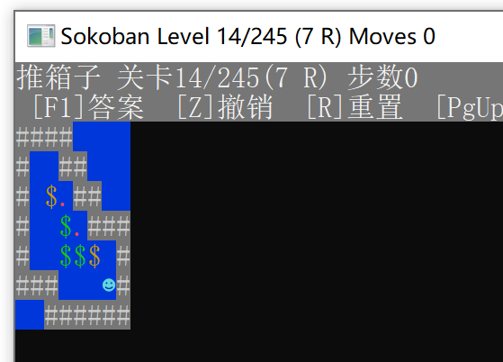
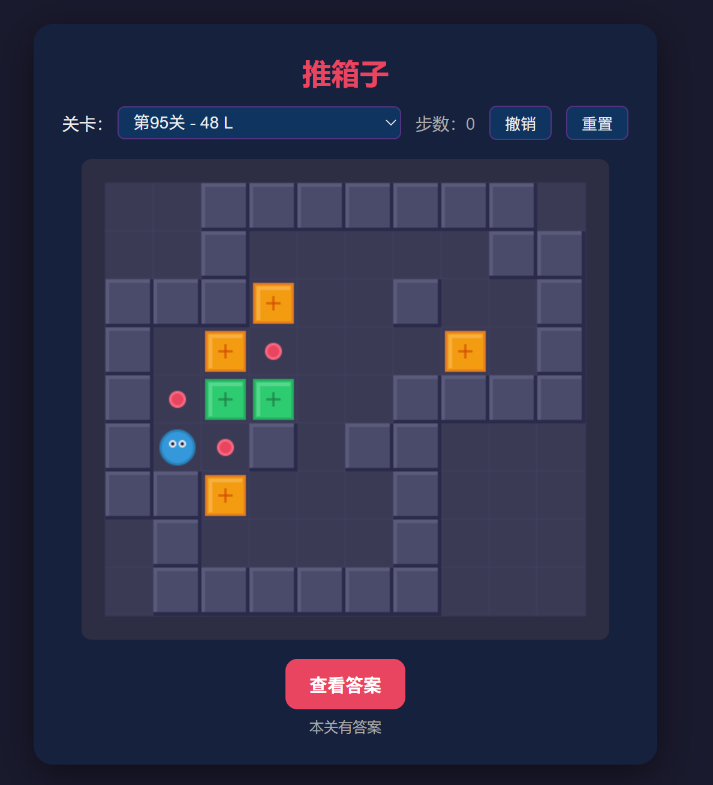
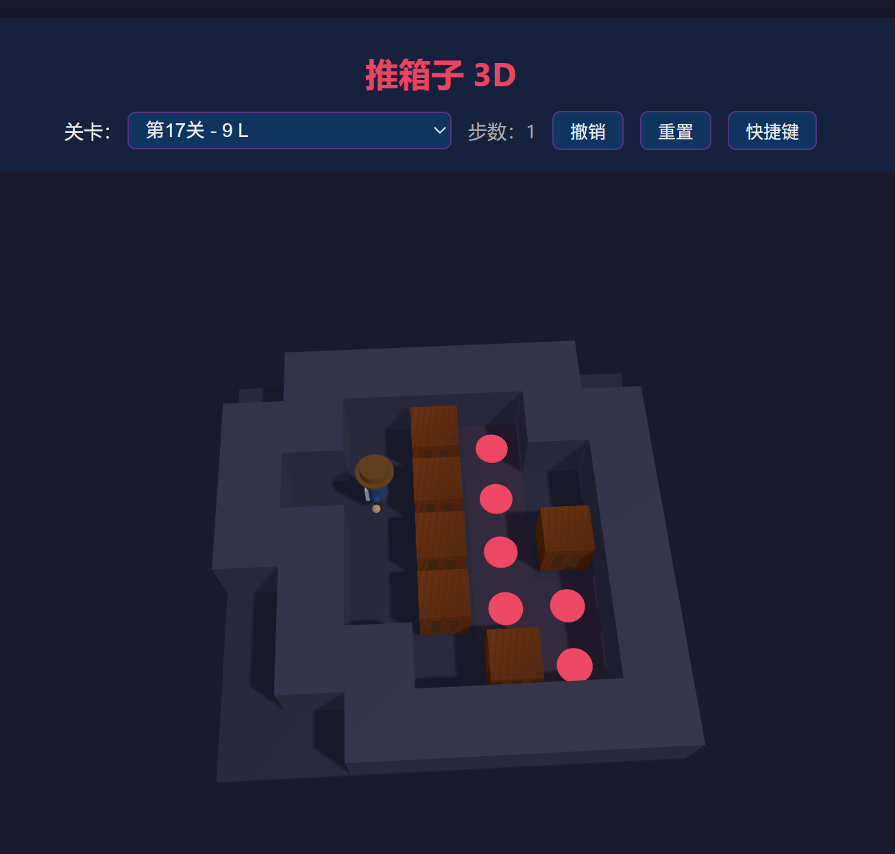

# Sokoban

> [中文版](README_zh.md)

A classic Sokoban puzzle game with **console**, **web**, and **console homebrew** ports.

## Features

- Classic Sokoban gameplay with many levels (`levels.json`)
- **C console** — lightweight terminal game
- **Multi-language CLIs** — Python / PHP / Lua / Node.js / Ruby / Java / C# / Kotlin / Perl / R / Haskell / Rust / Go / Zig / C++ / …
- **Classic & extended CLIs** — Lisp / Scheme / COBOL / Fortran / Pascal / Prolog / BASIC / Ada / Forth / Tcl / OCaml / Clojure / F# / Scala / Elixir / Erlang / Nim / … (full list in [TODO.md](TODO.md))
- **Desktop demos** — Pygame / Qt / Electron / SDL2 / Godot / raylib / Win32 / MFC / Tkinter / PyQt / WinForms / WPF / Avalonia / C# TUI / MAUI / WinUI3 / Blazor
- **2D / 3D web** — browser play (3D uses three.js) · React / Vue / Angular teaching · Cocos2d-style
- **Android** — `androidapp1/` (Kotlin, tap pathfinding + icon pad; [changelog](androidapp1/CHANGELOG.md))
- **iOS** — `iosapp1/` (SwiftUI teaching sources; no in-repo build required; [docs](iosapp1/README.md))
- **Nokia N81** — `n81app1/` (Java ME MIDP teaching demo; no build required; [docs](n81app1/README.md))
- **Wenquxing** — `wqxapp1/` (BBK e-dictionary C + HAL teaching project; no firmware build; [docs](wqxapp1/README.md))
- **Multi-stack teaching ports** — desktop/mobile/embedded/handheld/editor & browser extensions (see [TODO.md](TODO.md))
- **FC / NES** — `fcapp1/` (cc65 → `sokoban.nes`)
- **GB / GBC** — `gbapp1/` · `gbcapp1/` (teaching skeletons, GBDK)
- **NDS** — `ndsapp1/` (dual-screen teaching skeleton, libnds)
- **GBA** — `gbaapp1/` (bare-metal Mode 3 → `sokoban.gba`)
- **PSP** — `pspapp1/` (pspdev + sceGu → `EBOOT.PBP`)
- Pathfinding / answer playback where supported
- JSON level data for easy editing

## Project Structure

```
sokoban/
├── c_app/               # C console (Windows)
├── sokoban_linux/       # C console (Linux)
├── html_app/            # 2D web app
├── html_3dapp/          # 3D web app (three.js)
├── androidapp1/         # Android native app
├── iosapp1/             # iOS SwiftUI teaching demo
├── n81app1/             # Nokia N81 Java ME teaching demo
├── wqxapp1/             # BBK Wenquxing e-dictionary C teaching project
├── flutterapp1/         # Flutter
├── unityapp1/           # Unity C# scripts
├── rustapp1/            # Rust
├── goapp1/              # Go
├── zigapp1/             # Zig
├── pythonapp1/          # Python CLI
├── phpapp1/             # PHP CLI
├── luaapp1/             # Lua CLI
├── nodejsapp1/          # Node.js CLI
├── rubyapp1/            # Ruby CLI
├── javaapp1/            # Java CLI
├── csharpapp1/          # C# CLI
├── kotlinapp1/          # Kotlin CLI
├── perlapp1/            # Perl CLI
├── rapp1/               # R CLI
├── haskellapp1/         # Haskell CLI
├── lispapp1/            # Common Lisp CLI
├── schemeapp1/          # Scheme CLI
├── cobolapp1/           # COBOL CLI
├── fortranapp1/         # Fortran CLI
├── pascalapp1/          # Pascal CLI
├── prologapp1/          # Prolog CLI
├── basicapp1/           # FreeBASIC CLI
├── adaapp1/             # Ada CLI
├── forthapp1/           # Forth CLI
├── tclapp1/             # Tcl CLI
├── ocamlapp1/           # OCaml CLI
├── clojureapp1/         # Clojure CLI
├── fsharpapp1/          # F# CLI
├── scalaapp1/           # Scala CLI
├── elixirapp1/          # Elixir CLI
├── erlangapp1/          # Erlang CLI
├── nimapp1/             # Nim CLI
├── crystalapp1/         # Crystal CLI
├── dlangapp1/           # D CLI
├── swiftapp1/           # Swift CLI
├── dartapp1/            # Dart CLI
├── juliaapp1/           # Julia CLI
├── powershellapp1/      # PowerShell CLI
├── bashapp1/            # Bash CLI
├── cmdapp1/             # Windows CMD batch
├── awkapp1/             # AWK CLI
├── sqlapp1/             # SQL/SQLite CLI
├── cppapp1/             # C++ CLI
├── groovyapp1/          # Groovy CLI
├── vapp1/               # V CLI
├── odinapp1/            # Odin CLI
├── smalltalkapp1/       # Smalltalk CLI
├── modula2app1/         # Modula-2 CLI
├── algolapp1/           # Algol 68 CLI
├── iconapp1/            # Icon CLI
├── rexxapp1/            # REXX CLI
├── logoapp1/            # Logo CLI
├── aplapp1/             # APL CLI
├── factorapp1/          # Factor CLI
├── vbapp1/              # Visual Basic .NET CLI
├── vbaapp1/             # VBA (Excel macro) teaching
├── vb6app1/             # Visual Basic 6.0 teaching
├── win32app1/           # C Win32 API teaching
├── mfcapp1/             # MFC Doc/View teaching
├── tkinterapp1/         # Python Tkinter GUI
├── pyqtapp1/            # Python PyQt GUI
├── winformsapp1/        # C# WinForms
├── wpfapp1/             # C# WPF
├── avaloniaapp1/        # C# Avalonia
├── csharptuiapp1/       # C# console TUI
├── reactapp1/           # React (CDN)
├── vueapp1/             # Vue 3 (CDN)
├── angularapp1/         # Angular teaching + zero-build play
├── cocos2dapp1/         # Cocos2d-style Canvas
├── x11app1/             # X11/Xlib teaching
├── gtkapp1/             # GTK3 teaching
├── blazorapp1/          # Blazor WebAssembly
├── mauiapp1/            # .NET MAUI
├── winui3app1/          # WinUI 3
├── monoapp1/            # Mono / mcs
├── netaotapp1/          # .NET Native AOT
├── asm_common/          # ASM teaching C reference (playable)
├── asm_x86app1/ …       # multi-ISA asm skeletons (see TODO.md)
├── asm_wasmapp1/        # WebAssembly / WAT
├── pygameapp1/          # Pygame (html_app-like 2D)
├── qtapp1/              # Qt Widgets desktop
├── electronapp1/        # Electron desktop
├── sdlapp1/             # SDL2 desktop
├── godotapp1/           # Godot 4 desktop
├── raylibapp1/          # raylib desktop
├── wxgame1/             # WeChat mini-game
├── harmonyapp1/         # HarmonyOS ArkTS
├── esp32app1/           # ESP32 (ESP-IDF)
├── stm32app1/           # STM32
├── arduinoapp1/         # Arduino
├── linuxfbapp1/         # Linux framebuffer
├── casioapp1/           # Casio calculator abstraction
├── dosapp1/             # DOS
├── gbapp1/              # Game Boy teaching
├── gbcapp1/             # Game Boy Color teaching
├── ndsapp1/             # Nintendo DS teaching
├── vscodeext1/          # VS Code extension
├── vs2026ext1/          # Visual Studio extension teaching
├── chromeext1/          # Chrome extension
├── edgeext1/            # Edge extension
├── firefoxext1/         # Firefox extension
├── vimext1/             # Vim plugin
├── nvimext1/            # Neovim Lua plugin
├── safariext1/          # Safari Web Extension
├── emacsext1/           # Emacs package
├── jetbrainsext1/       # JetBrains IDE plugin
├── fcapp1/              # FC / NES homebrew
├── gbaapp1/             # GBA homebrew
├── pspapp1/             # PSP homebrew
├── scripts/             # Solvers and converters
├── TODO.md              # Multi-platform port checklist
├── levels.json          # Level definitions
└── documents/           # Screenshots, etc.
```

## Screenshots

| C Console Version | 2D Web Version | 3D Web Version |
|:---:|:---:|:---:|
|  |  |  |

## Getting Started

### 2D Web Version

Open `index.html` in any modern browser. No server required.

### 3D Web Version

Open `html_3dapp/index.html` in a modern browser through a local HTTP server.

Example:

```bash
cd html_3dapp
python -m http.server 8765
```

Then visit `http://localhost:8765/`.

### Android

See [androidapp1/README.md](androidapp1/README.md) · [changelog](androidapp1/CHANGELOG.md).

Requires Android SDK, JDK 17+, and `androidapp1/local.properties` with `sdk.dir` (do not commit that file).

```bat
cd androidapp1
gradlew.bat assembleDebug
```

Debug APK: `androidapp1/app/build/outputs/apk/debug/app-debug.apk`

### iOS (teaching demo)

See [iosapp1/README.md](iosapp1/README.md) · [changelog](iosapp1/CHANGELOG.md) · [dev cheat sheet](iosapp1/Sokoban/DEVELOPMENT.md).

Full SwiftUI sources showing how an iOS app is structured (and how it maps to Android). **Not required to compile in this repo.** On a Mac, create an Xcode App project and add `iosapp1/Sokoban/` to run.

### Nokia N81 (Java ME teaching demo)

See [n81app1/README.md](n81app1/README.md) · [changelog](n81app1/CHANGELOG.md) · [dev notes](n81app1/docs/DEVELOPMENT.md).

MIDP 2.0 MIDlet sources for feature-phone Java (lifecycle, `Canvas`, keypad). **Not required to compile in this repo.**

### Wenquxing (BBK e-dictionary, C teaching project)

See [wqxapp1/README.md](wqxapp1/README.md) · [changelog](wqxapp1/CHANGELOG.md) · [dev notes](wqxapp1/docs/DEVELOPMENT.md).

Portable C Sokoban with a `wqx_api` HAL for dictionary-class devices. **Not required to build device firmware in this repo.**

### Other teaching stacks

See **[TODO.md](TODO.md)**. Each folder has its own README (mostly demos/skeletons). Includes Safari, Emacs, JetBrains plugins, browser extensions, consoles, handhelds, etc.

### C Console Version

```bash
cd c_app
make
./sokoban.exe
```

Requires a C compiler (e.g., GCC / MinGW on Windows).

### Multi-language CLIs

Teaching mini-level. Controls: WASD, z undo, r reset, q quit.

```bash
cd pythonapp1  && python -X utf8 main.py
cd phpapp1     && php main.php
cd luaapp1     && lua main.lua
cd nodejsapp1  && node main.js
cd rubyapp1    && ruby main.rb
cd javaapp1    && javac *.java && java Main
cd csharpapp1  && dotnet run
cd kotlinapp1  && kotlinc Game.kt Main.kt -include-runtime -d sokoban.jar && java -jar sokoban.jar
cd perlapp1    && perl main.pl
cd rapp1       && Rscript main.R
cd haskellapp1 && ghc Main.hs Game.hs -o sokoban && ./sokoban
# classic / historical languages
cd lispapp1    && sbcl --script main.lisp
cd schemeapp1  && guile -l game.scm -s main.scm
cd cobolapp1   && cobc -x -free main.cbl game.cbl -o sokoban && ./sokoban
cd fortranapp1 && gfortran -O2 game.f90 main.f90 -o sokoban && ./sokoban
cd pascalapp1  && fpc -O2 main.pas && ./main
cd prologapp1  && swipl -q -s main.pl
cd basicapp1   && fbc -O 2 main.bas && ./main
# more classic / modern languages (see TODO.md for full list)
cd adaapp1         && gnatmake main.adb
cd tclapp1         && tclsh main.tcl
cd ocamlapp1       && ocamlc -o sokoban game.ml main.ml && ./sokoban
cd clojureapp1     && clj -M main.clj
cd fsharpapp1      && dotnet run
cd cppapp1         && g++ -std=c++17 -O2 main.cpp -o sokoban && ./sokoban
cd powershellapp1  && pwsh -NoProfile -File main.ps1
cd bashapp1        && bash main.sh
cd cmdapp1         && main.cmd
cd sqlapp1         && python -X utf8 main.py
cd juliaapp1       && julia main.jl
cd nimapp1         && nim c -r main.nim
cd dartapp1        && dart run main.dart
cd groovyapp1      && groovy main.groovy
cd vbapp1          && dotnet run
# VBA (Excel): see vbaapp1/README.md — import macros, run SokobanMain
# VB6: see vb6app1/README.md — open sokoban.vbp in VB6, F5
# … every folder has its own README
```

### Desktop demos

| Folder | How to run |
|--------|------------|
| [pygameapp1](pygameapp1/README.md) | `pip install pygame` → `python main.py` |
| [tkinterapp1](tkinterapp1/README.md) | stdlib → `python main.py` |
| [pyqtapp1](pyqtapp1/README.md) | `pip install PyQt5` → `python main.py` |
| [win32app1](win32app1/README.md) | teaching sources; optional MinGW/MSVC |
| [mfcapp1](mfcapp1/README.md) | MFC Doc/View teaching; no in-repo build |
| [winformsapp1](winformsapp1/README.md) | optional `dotnet run` (Windows) |
| [wpfapp1](wpfapp1/README.md) | optional `dotnet run` (Windows) |
| [avaloniaapp1](avaloniaapp1/README.md) | optional `dotnet run` (cross-platform) |
| [csharptuiapp1](csharptuiapp1/README.md) | optional `dotnet run` (ANSI TUI) |
| [reactapp1](reactapp1/README.md) | open `index.html` (CDN, no npm) |
| [vueapp1](vueapp1/README.md) | open `index.html` (CDN Vue 3) |
| [angularapp1](angularapp1/README.md) | open `play.html`; components in `src/app/` |
| [cocos2dapp1](cocos2dapp1/README.md) | open `index.html` (Director/Layer teaching) |
| [x11app1](x11app1/README.md) | Xlib teaching; optional `gcc … -lX11` |
| [gtkapp1](gtkapp1/README.md) | GTK3 teaching; optional `pkg-config gtk+-3.0` |
| [blazorapp1](blazorapp1/README.md) | Blazor WASM; optional `dotnet run` |
| [mauiapp1](mauiapp1/README.md) | .NET MAUI teaching sources; no in-repo build required |
| [winui3app1](winui3app1/README.md) | WinUI 3 teaching sources; no in-repo build required |
| [monoapp1](monoapp1/README.md) | Mono: `mcs` + `mono` |
| [netaotapp1](netaotapp1/README.md) | .NET Native AOT: `dotnet publish` |
| [asm_common](asm_common/README.md) | ASM teaching C reference (playable) |
| [asm_wasmapp1](asm_wasmapp1/README.md) | WAT + browser playable host |
| other `asm_*app1/` | x86/x64/ARM/Thumb/AArch64/RISC-V/MIPS/PPC/AVR/Z80/6502/LoongArch — see [TODO.md](TODO.md) |
| [qtapp1](qtapp1/README.md) | `qmake && make` |
| [electronapp1](electronapp1/README.md) | `npm install && npm start` |
| [sdlapp1](sdlapp1/README.md) | SDL2 + `make` |
| [godotapp1](godotapp1/README.md) | Open `project.godot` in Godot 4 |
| [raylibapp1](raylibapp1/README.md) | raylib + `make` |

### FC / NES

See [fcapp1/README.md](fcapp1/README.md). Open `fcapp1/sokoban.nes` in any NES emulator.

```bat
cd fcapp1
build.bat
```

### GBA

See [gbaapp1/README.md](gbaapp1/README.md). Open `gbaapp1/sokoban.gba` in mGBA, etc.

```bat
cd gbaapp1
build.bat
```

### PSP

See [pspapp1/README.md](pspapp1/README.md). Open `pspapp1/EBOOT.PBP` in PPSSPP.

Recommended build: **WSL Ubuntu + ~/pspdev**

```bat
cd pspapp1
build_wsl.bat
```

## Controls

### C Console Version

| Key              | Action          |
|------------------|----------------|
| Arrow keys / WASD | Move player    |
| Z                | Undo move      |
| R                | Reset level    |
| F1               | AI solve       |
| F2               | Select level   |
| Space            | Next level (when won) |
| PageUp           | Previous level |
| PageDown         | Next level     |
| Q / Esc          | Quit           |

### 2D Web Version

| Key              | Action          |
|------------------|----------------|
| Arrow keys / WASD | Move player    |
| Z                | Undo move      |
| R                | Reset level    |
| F1               | View answer    |
| Space            | Next level (when won) |
| PageUp           | Previous level |
| PageDown         | Next level     |

### 3D Web Version

| Key / Mouse       | Action          |
|-------------------|----------------|
| Arrow keys / WASD | Move player    |
| Z                 | Undo move      |
| R                 | Reset level    |
| F1                | View answer    |
| Space             | Next level (when won) |
| PageUp            | Previous level |
| PageDown          | Next level     |
| Mouse drag        | Rotate camera  |

## License

MIT
